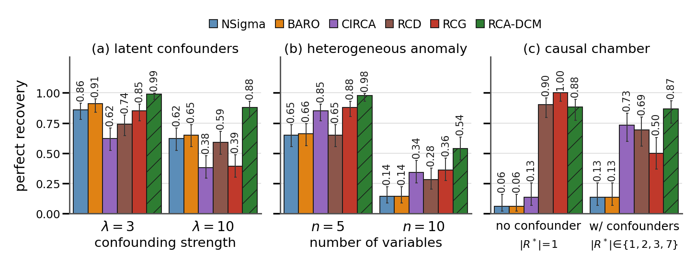
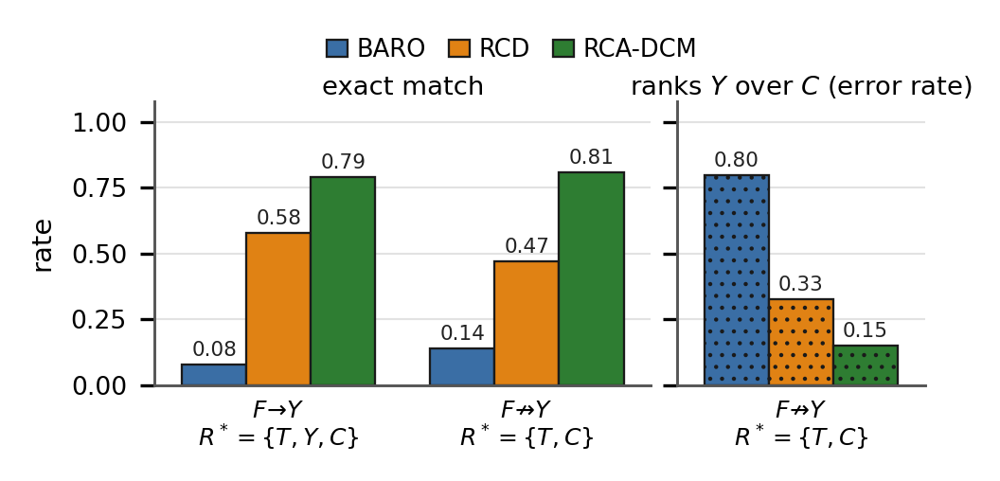

# RCA-DCM

Root-cause analysis with deep causal models on acyclic directed mixed graphs.
For each candidate, the model ties that node's mechanism across a normal regime
and an anomalous regime, then scores the node by how far apart the two
generated distributions remain. A higher score is a more likely root cause.

The method is compared with NSigma, BARO, CIRCA, RCD, and RCG. The metric in
the figures is perfect recovery: the top-|R\*| predictions equal the true
root-cause set. Error bars are 95% confidence intervals. Hatched bars are
RCA-DCM.

Python 3.10. A GPU is optional. The synthetic runs used CPU. The causal-chamber
runs used a GPU.

## Three benchmarks



*Perfect recovery (95% confidence intervals). (a) Synthetic graphs with 6 observed variables and 4 latent confounders, as the latent-edge strength λ grows. (b) Heterogeneous anomalies, where a downstream non-cause can out-shift a true cause. (c) The causal chamber, with the root cause observed and with it hidden. RCA-DCM is the only method that stays high in all three. Overlapping intervals do not rule out a paired difference. PDF: [`figures/row_all3_forest_hatch.pdf`](figures/row_all3_forest_hatch.pdf).*

**(a) Latent confounding.** Six observed variables, four hidden confounders, three root causes, 100 trials, 5,000 normal and 5,000 anomalous samples, 50 epochs. At λ = 3, RCA-DCM recovers the set in 99% of trials. At λ = 10 it recovers 88%. Every baseline falls further: BARO from 0.91 to 0.65, RCG from 0.85 to 0.39. A stronger confounder shifts several observed variables at once, so a non-cause can look intervened if you only watch its marginal. RCA-DCM tests whether the conditional mechanism changed, and treats the bidirected edges as shared latent noise.

**(b) Heterogeneous anomalies.** No latent confounders. The injected shift grows with topological position, so a descendant can move more than an upstream cause. This happens in about 60% of the n = 10 trials. RCA-DCM recovers 98% of sets at n = 5 and 54% at n = 10. NSigma and BARO fall to 14% at n = 10, which is the failure this design is built to produce. RCG, CIRCA, and RCD land at 0.36, 0.34, and 0.28.

**(c) Causal chamber.** Fifty-two interventions on a real light tunnel. When the cause is observed, RCG is perfect (1.00) and RCD reaches 0.90. RCA-DCM is at 0.88 and does not lead. When the cause is hidden and becomes a confounder of its children, that order reverses: RCA-DCM stays at 0.87, and the best baseline (CIRCA) is at 0.73. RCG drops from 1.00 to 0.50. RCA-DCM is the only method that barely moves between the two conditions.

| | NSigma | BARO | CIRCA | RCD | RCG | RCA-DCM |
|---|---:|---:|---:|---:|---:|---:|
| λ = 3 | 0.86 | 0.91 | 0.62 | 0.74 | 0.85 | **0.99** |
| λ = 10 | 0.62 | 0.65 | 0.38 | 0.59 | 0.39 | **0.88** |
| n = 5 | 0.65 | 0.66 | 0.85 | 0.65 | 0.88 | **0.98** |
| n = 10 | 0.14 | 0.14 | 0.34 | 0.28 | 0.36 | **0.54** |
| chamber, cause observed | 0.06 | 0.06 | 0.13 | 0.90 | **1.00** | 0.88 |
| chamber, cause hidden | 0.13 | 0.13 | 0.73 | 0.69 | 0.50 | **0.87** |

## A weak second cause

The next figure asks a sharper question. One root cause, C, is real but small. Another variable, Y, inherits a large shift from a heavily intervened parent T. Y is itself a root cause only when the direct edge F→Y is present.



*Wasserstein score. Left: exact recovery of the root-cause set. With F→Y present the set is {T, Y, C}. With F→Y absent it is {T, C}, and ranking Y is a mistake. Right: how often a method ranks the non-cause Y above the true cause C. That panel is an error rate, so lower is better. PDF: [`figures/weakC_metric_wasserstein_forest.pdf`](figures/weakC_metric_wasserstein_forest.pdf).*

RCA-DCM recovers the set in 79% of trials when Y is a cause and in 81% when it is not. When Y is not a cause, it still ranks Y above C in 15% of trials. BARO does so in 80%, and RCD in 33%. BARO's exact-match rate on the same condition is 14%.

## A wrong graph

The λ = 10 trials above are repeated with the data held fixed and only the graph given to RCA-DCM changed.

| graph given to RCA-DCM | perfect recovery |
|---|---:|
| True graph | 0.88 |
| 50% extra directed and bidirected edges | 0.84 |
| 50% of the bidirected edges removed | 0.87 |
| 50% of both edge types removed | 0.76 |

Adding edges, or dropping half the confounders, does not change the result by a meaningful amount. Removing directed edges does: recovery falls from 0.88 to 0.76, because each mechanism is then fit against an incomplete parent set.

## Microservices

Sock Shop and Online Boutique have the same five faults (CPU, memory, disk, delay, packet loss), each injected five times into five services: 125 cases per dataset. No call graph is given to RCA-DCM. It receives a sink-confounded star: every service points at the candidate, and one shared latent confounds the rest. CIRCA and RCG receive the call graph. NSigma, BARO, and RCD use no graph.

On Sock Shop, RCA-DCM's top-1 accuracy is 0.89, ahead of NSigma (0.75), BARO (0.74), CIRCA (0.65), RCG (0.54), and RCD (0.38). Top-3 accuracy is 0.99. On Online Boutique, RCA-DCM is first again at 0.78, ahead of RCG (0.71) and NSigma (0.70). No baseline is second on both datasets. CPU and memory are recovered almost perfectly. Packet loss is the weak fault on both (0.80 and 0.44), and every method drops there.

| dataset | RCA-DCM | NSigma | BARO | CIRCA | RCG | RCD |
|---|---:|---:|---:|---:|---:|---:|
| Sock Shop, top-1 | **0.89** | 0.75 | 0.74 | 0.65 | 0.54 | 0.38 |
| Sock Shop, top-3 | **0.99** | 0.97 | 0.98 | 0.96 | 0.67 | 0.54 |
| Online Boutique, top-1 | **0.78** | 0.70 | 0.62 | 0.52 | 0.71 | 0.49 |
| Online Boutique, top-3 | 0.90 | **0.91** | 0.90 | 0.89 | 0.83 | 0.59 |

Top-1 by fault, for RCA-DCM:

| dataset | CPU | memory | disk | delay | loss |
|---|---:|---:|---:|---:|---:|
| Sock Shop | 1.00 | 0.96 | 0.76 | 0.92 | 0.80 |
| Online Boutique | 1.00 | 1.00 | 0.64 | 0.80 | 0.44 |

A plain sink graph, with the shared latent removed, picks the same top-1 service on all 125 cases of each dataset.

Case-level tables are in [`examples/results/`](examples/results/). One worked ranking, for Sock Shop `carts` under CPU stress, is [`examples/results/sockshop_carts_cpu_r1/root_cause_results.csv`](examples/results/sockshop_carts_cpu_r1/root_cause_results.csv). `carts` is first.

## Try one case

```bash
pip install -r requirements.txt
bash examples/run_sample.sh
```

This scores the Sock Shop case shipped with the repository. It uses the same graph and early-stopping settings as the microservice table, on one replicate. The ranking is written to `dcm/out/sockshop_sample/cpu/carts_cpu_r1/root_cause_results.csv`. The injected service is `carts`. Training is unseeded, so the scores will differ slightly from the published file. The order is what to compare.

A few real inputs are included so the column layout is visible without the full downloads. [`examples/README.md`](examples/README.md) describes each one.

| | |
|---|---|
| Synthetic normal and anomalous samples, graph, true causes | [`examples/synthetic/lambda10_one_graph/`](examples/synthetic/lambda10_one_graph/) |
| Ranking for that graph (`X4`, `X2`, `X6`) | [`examples/results/synthetic_lambda10/root_cause_results.csv`](examples/results/synthetic_lambda10/root_cause_results.csv) |
| One Sock Shop series | [`examples/microservice/sock-shop-2/carts_cpu/1/`](examples/microservice/sock-shop-2/carts_cpu/1/) |
| One Online Boutique series | [`examples/microservice/online-boutique/currencyservice_delay/2/`](examples/microservice/online-boutique/currencyservice_delay/2/) |
| Causal-chamber reference and one intervention | [`examples/causal_chamber/`](examples/causal_chamber/) |

## Reproduce

Run from this directory. A fresh training run lands within about ±0.05 of the tables, because training is unseeded. The paper comparisons are paired on the same draws.

Redraw the three-panel figure from the summary CSVs already in the repository:

```bash
python3 baselines/paper_experiments/plot_row.py --palette forest --height 1.42 --hatch_dcm
```

That writes `baselines/paper_experiments/out/row_all3_forest_hatch.pdf`. The copy in [`figures/`](figures/) is the file used in the paper.

**Latent confounding.** The script generates the data.

```bash
bash baselines/paper_experiments/run_rerun_noES.sh
```

**Heterogeneous anomalies.**

```bash
bash baselines/paper_experiments/run_v5_floor.sh
bash baselines/paper_experiments/run_v10_noES.sh
```

**Wrong graph.** Run the λ = 10 experiment first. These commands only change the graph.

```bash
D=baselines/paper_experiments/exp1_confounding/ls10_noES/data/lit_random_v10_lat4_none_latnstrg10.0_Ns5000As5000
R=baselines/paper_experiments/exp_misspec
python3 $R/run_misspec.py --data_root "$D" --mode true        --frac 0   --graph_name lit_random_v10_lat4 --num_epc 50 --limit 100 --gpu_id 0 --out $R/ls10_control
python3 $R/run_misspec.py --data_root "$D" --mode dense       --frac 0.5 --graph_name lit_random_v10_lat4 --num_epc 50 --limit 100 --gpu_id 0 --out $R/ls10_dense50
python3 $R/run_misspec.py --data_root "$D" --mode bi_sparse   --frac 0.5 --graph_name lit_random_v10_lat4 --num_epc 50 --limit 100 --gpu_id 0 --out $R/ls10_bisparse50
python3 $R/run_misspec.py --data_root "$D" --mode both_sparse --frac 0.5 --graph_name lit_random_v10_lat4 --num_epc 50 --limit 100 --gpu_id 0 --out $R/ls10_bothsparse50
python3 $R/plot_misspec.py
```

**Causal chamber.** Download `lt_interventions_standard_v1` and point `CAUSAL_CHAMBER_DATA` at the folder of CSVs. Two sample files are in `examples/causal_chamber/`. The commands below need the full set. The hidden-cause run is fixed at 50 epochs.

```bash
export CAUSAL_CHAMBER_DATA=/path/to/lt_interventions_standard_v1/data

python3 baselines/causal_chamber/run_baselines_cc.py
python3 baselines/causal_chamber/run_dcm.py --gpu_id 0 --thr_num 12

python3 baselines/causal_chamber_hidden_rc/run_baselines_cc.py
python3 baselines/causal_chamber_hidden_rc/run_dcm.py --gpu_id 0 --thr_num 12 \
  --no_early_stop --num_epc 50 \
  --out baselines/causal_chamber_hidden_rc/out/dcm_results_noES.csv

python3 baselines/paper_experiments/causal_chamber/build_summary.py --dcm_hidden dcm_results_noES.csv
python3 baselines/paper_experiments/causal_chamber/plot_cc.py
```

**Sock Shop and Online Boutique.** Download `sock-shop-2` and `online-boutique` (RCAEval, Zenodo record 13305663). The samples under `examples/microservice/` use the same layout.

```bash
export RCAEVAL_DATA_ROOT=/path/to/rcaeval_data

python3 run_sink_graph.py --dataset sockshop --sink_confounded --engine original \
  --early_stop --max_epc 50 --thr_num 14 --tag sink_confounded
python3 run_sink_graph.py --dataset onlineboutique --sink_confounded --engine original \
  --early_stop --max_epc 50 --thr_num 12 --tag sink_confounded

python3 baselines/RCAEval/run_baselines.py --dataset sockshop
python3 baselines/RCAEval/run_baselines.py --dataset onlineboutique
python3 score_sink.py sockshop onlineboutique
```

`RCAEVAL_DATA_ROOT` defaults to `data/rcaeval` in this repository. `run_sink_graph.py` writes `dcm/out/{dataset}_sink_confounded_results.csv`. `score_sink.py` reads the plain-sink file `dcm/out/{dataset}_sink_results.csv`.

Per-experiment notes:

- [`baselines/paper_experiments/exp1_confounding/README.md`](baselines/paper_experiments/exp1_confounding/README.md)
- [`baselines/paper_experiments/exp2_heterogeneous/README.md`](baselines/paper_experiments/exp2_heterogeneous/README.md)
- [`baselines/paper_experiments/exp_misspec/README.md`](baselines/paper_experiments/exp_misspec/README.md)
- [`baselines/paper_experiments/causal_chamber/README.md`](baselines/paper_experiments/causal_chamber/README.md)

## Layout

```text
figures/                     the two figures used in the paper
examples/                    a few datasets and the published result tables
dcm/                         RCA-DCM (training, flows, graphs)
run_sink_graph.py            microservice runner
score_sink.py                top-k tables from a results CSV
baselines/LIT/               synthetic generator and experiment driver
baselines/RCAEval/           NSigma, BARO, CIRCA, RCD, RCG
baselines/causal_chamber/    causal chamber, observed root cause
baselines/causal_chamber_hidden_rc/   causal chamber, hidden root cause
baselines/paper_experiments/ launch scripts, plots, summary CSVs
```
